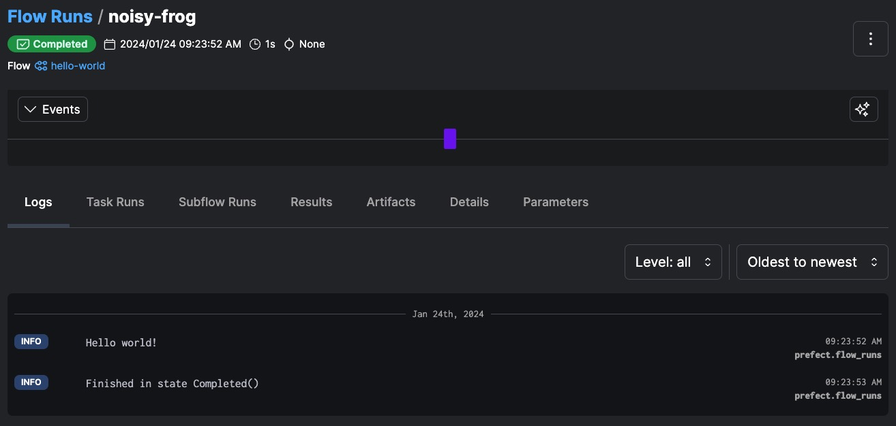

# Getting Started with Prefect for Python Beginners

Welcome to the world of Python and Prefect! This guide is designed to help beginners set up a Python environment, install Prefect, and log into Prefect Cloud. Let's get started.
## Prerequisites

Before you begin, ensure you have:
- Basic understanding of using a terminal or command prompt.
- Access to the internet for downloading necessary software.
## Step 1: Install Python

Prefect requires Python. If you don’t have Python installed, download and install Python 3.10 or an earlier version from [python.org]().
## Step 2: Set Up a Virtual Environment

A virtual environment is a self-contained directory that contains a Python installation for a particular version of Python, plus a number of additional packages. It's a best practice to use a virtual environment for each Python project to manage dependencies more effectively. 
1. **Open your terminal or command prompt.** 
2. **Create a new directory for your project and navigate into it:** 

    ```bash
    mkdir pacc2024
    cd pacc2024
    ``` 
3. **Create a virtual environment:**  
    On Windows:

    ```bash
    python -m venv env
    ``` 
    On macOS and Linux:

    ```bash
    python3 -m venv env
    ``` 
4. **Activate the virtual environment:**  
    On Windows:

    ```bash
    .\env\Scripts\activate
    ``` 
    On macOS and Linux:

    ```bash
    source env/bin/activate
    ```

Your command prompt should now indicate that you are in the virtual environment.
## Step 3: Install Prefect and Prefect Docker

With your virtual environment activated, install Prefect and Prefect Docker using pip, Python's package installer.

```bash
pip install prefect prefect-docker
```


## Step 4: Log into Prefect Cloud from Your Browser 

1. **and log in**  You can sign up for a free account or accept an invitation from your organization. 
2. to avoid creating a duplicate account, IF your company has already set up SSO, try signing up with SSO first. 

## Step 5: Log into Prefect Cloud from Your Terminal 
**In your terminal, enter the following command:** 

```bash
prefect cloud login
``` 

*.*
## Step 6: Set Your Workspace

Set your workspace to the one you want to work in:

```bash
prefect cloud workspace set
```


Choose the desired workspace from the list that appears.
## Step 7: Start Coding!

Now that you're all set up, you'll want to start writing Python scripts to define your Prefect flows. If you're new to coding, consider using a code editor like Visual Studio Code or PyCharm.

## 8. Run a [hello world flow](hello_world_flow.py) and verify that you can see the flow run in the UI.

Create a new file and call it `hello_world_flow.py`.

`pacc2024/hello_world_flow.py`
```python
from prefect import flow

@flow(log_prints=True)
def hello_world():
    print("Hello world!")

if __name__ == "__main__":
    hello_world() # Here we call the flow function so that we get a flow run when we run this file.
```

Run the file to run the flow.
```bash
python pacc2024/hello_world_flow.py
```

Click on the link listed in the flow run logs:
```bash
(venv) ➜  prefect-pacc-2024 git:(main) python hello_world_flow.py 
09:23:52.648 | INFO    | prefect.engine - Created flow run 'noisy-frog' for flow 'hello-world'
09:23:52.650 | INFO    | Flow run 'noisy-frog' - View at https://app.prefect.cloud/account/9b649228-0419-40e1-9e0d-44954b5c0ab6/workspace/f7fe0729-5a91-40a4-a800-4bb8c5b6a6f5/flow-runs/flow-run/ea412cbd-9878-41e6-9e36-0be279230875
09:23:52.867 | INFO    | Flow run 'noisy-frog' - Hello world!
09:23:53.393 | INFO    | Flow run 'noisy-frog' - Finished in state Completed()
```
In the UI, you should see a flow run with a randomly generated adjective-animal name that has no tasks:


🎉 Congrats! You're all set to start diving in and learning Prefect!