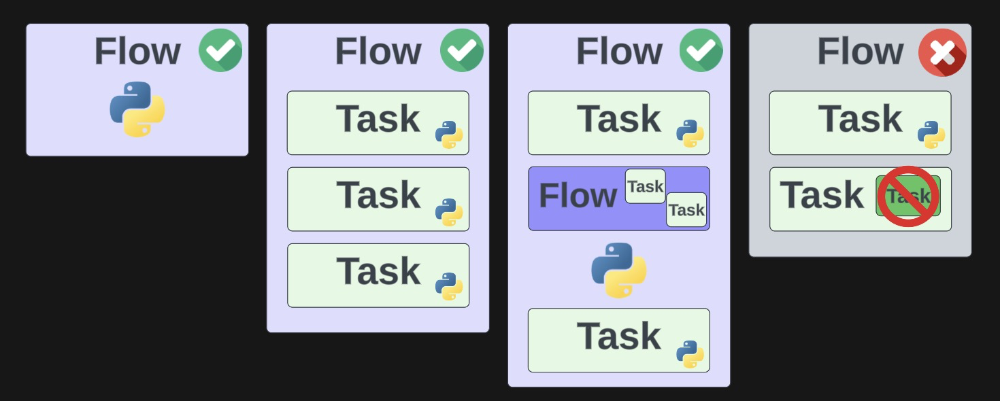

# Basic Syntax Quickstart

### Rules of Thumb
- At a minimum, you need to define at least one flow function.
- Your flows can be segmented by introducing task (`@task`) functions, which can be invoked from within these flows.
- A task represents a discrete unit of Python code, whereas flows are more akin to parent functions accommodating a broad range of workflow logic.
- Flows can be called inside of other flows (we call these subflows) but a task **cannot** be run inside of another task or from outside the context of a flow.

## Module 1 Lab

1. Create your first flows and task modeled off the [basic-syntax](basic_syntax.py) script.
2. Try adding [caching](caching_tasks.py) and [retries](retries.py) to your tasks and flows.
3. Add a [custom log](custom_logs.py).
4. Optional: Submit your tasks to the concurrent task runner for [concurrent execution](concurrent_tasks.py).
5. Optional: Generate an [artifact](prefect_artifact.py) from one of your tasks or flows.