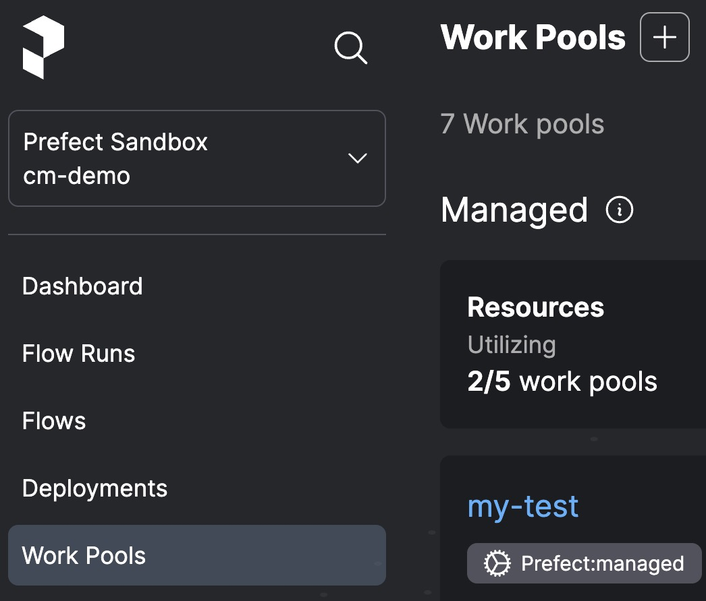

# Deployment Quickstart


For conceptual breakdown of the diagram, go to [Architecture Diagrams Walkthrough](archetecture_diagrams_walkthrough.md).

### 1. [Create a work pool](https://docs.prefect.io/latest/tutorial/workers/#create-a-work-pool) or choose one that already exists in your workspace.
_Creating a work pool in the UI_ is recommended for your first go of it so you that get a sense of all the options.

Call your work pool something like `name-pacc-work-pool`.

Click the `+` button:


To see any existing work pools:
```bash
prefect work-pool ls
``` 

Alternatively, you can create a work pool with the following command:
```bash
prefect work-pool create "my-pacc-work-pool" --type docker
```

### 2. [Start a worker](https://docs.prefect.io/latest/tutorial/workers/#start-a-worker) to poll this work pool.

Ensure your docker daemon is running.

Install the required library:
```python
pip install prefect-docker
```

On your laptop, open up a new terminal, activate your python environment, and type:
```bash
prefect worker start --pool my-pacc-work-pool
```
^Keep this guy running for as long as you want to run deployments on your laptop. Go to our [guides]() when you are ready to start a worker in a production environment (aka not on your laptop)

### 3. Now you're all set [create a deployment](https://docs.prefect.io/latest/tutorial/workers/#create-the-deployment) to send your flow to your work pool.


1. Ensure your docker daemon is running because when you run `flow.deploy()`, [Prefect will build a custom Docker image](https://docs.prefect.io/latest/tutorial/workers/#create-the-deployment:~:text=Prefect%20will%20build%20a%20custom%20Docker%20image%20containing%20your%20workflow%20code%20that%20the%20worker%20can%20use%20to%20dynamically%20spawn%20Docker%20containers%20whenever%20this%20workflow%20needs%20to%20run.) containing your workflow code that the worker can use to dynamically spawn Docker containers whenever this workflow needs to run.

2. Use the `flow.deploy()` method to define a deployment:

    `my_flow.py`

    ```python title="my_flow.py"
    from prefect import flow


    @flow(log_prints=True)
    def my_flow(name: str = "World"):
        print(f"Hello {name}!")

    if __name__ == "__main__":
        my_flow.deploy(
            name="taylor-pacc-deployment", # add your name and 'pacc' so its easy to find
            work_pool_name="my-pacc-work-pool", 
            image="my-first-deployment-image:pacc",
            push=False,
            tags=["pacc", "taylor"] # add tags
        )
    ```

3. Run your python script:
    ```bash
    python my_flow.py
    ```

### 4. Find your deployment in the UI and run it using the quick run button at the top right.


Alternatively, you can run the deployment from the CLI
```bash
prefect deployment run 'my_flow/my-deployment'
```