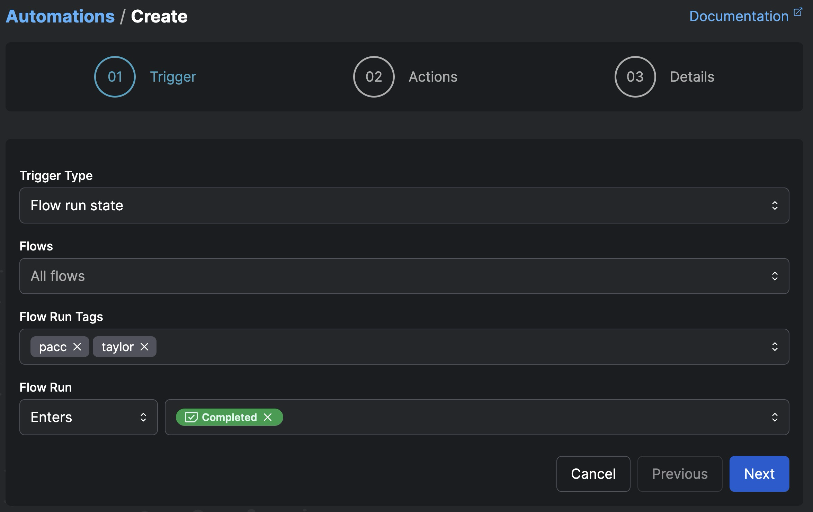
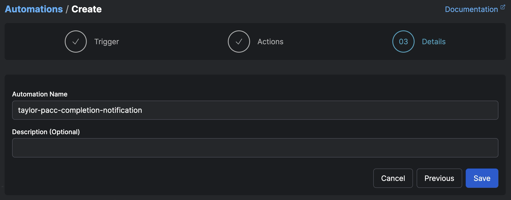

# Automations and Events Quickstart

Make an email notification automation that fires on any flow run completion
Explore the event feed in the UI
Create and resolve an incident
Stretch - create a custom event with emit_event and use it in an automation notification

### 1. Create a notification automation that fires on flow run completion.
1. Find the Automations page in the UI and click the `+` button.
2. Define your trigger:

    Add your own email.
    
3. Define your action:

    Use the block you created during the [blocks quickstart](../3_blocks_integrations/README.md).
    
4. Name your automation:
    
5. Run a deployment (ensure that it meets the criteria set in your automation's trigger, eg. the tags `pacc` and `taylor`)

### 2. Browse the events dashboard.