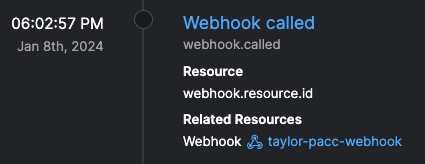
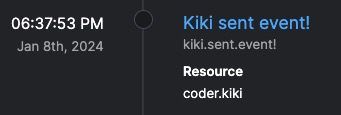
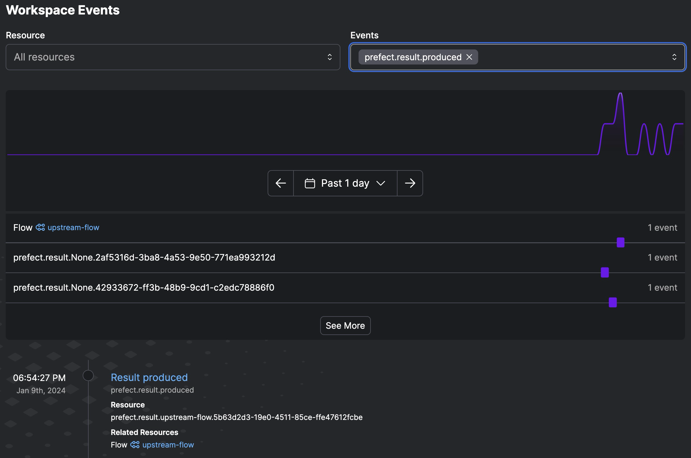
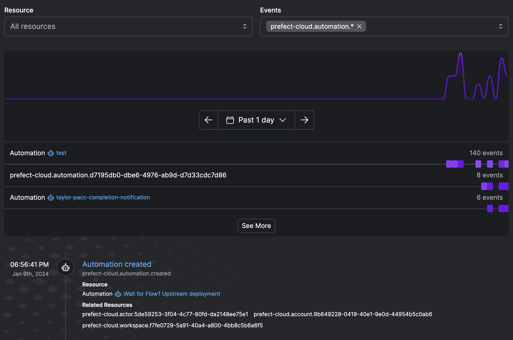

# Custom Events, Event Webhooks, and State Change Hooks Quickstart

There are two ways to get things that happen outside of Prefect into your workspace's event feed, Event Webhooks, and Custom Emitted Events.

## Create and call an [Event Webhook](https://docs.prefect.io/latest/guides/webhooks/).
Webhooks are great for getting events into Prefect from outside of a Python environment.

1. Find the Event Webhooks page and create an Event Webhook.
    
2. Copy the Webhook URL and call the endpoint from your terminal:

    ```bash
    curl https://api.prefect.cloud/hooks/your_slug_here
    ```
3. Navigate to the events page and find the Webhook called event.
    
4. Optional: Create a [dynamic webhook event](https://docs.prefect.io/latest/guides/webhooks/#dynamic-webhook-events)
    Here is a [blog post](https://www.prefect.io/blog/github-issues-prefect-marvin) with a great example use case of dynamic webhook events.

## [Emit a custom event](https://docs.prefect.io/latest/concepts/events/#event-sources)

1. Run this python function to emit an event:
    ```python
    from prefect.events import emit_event

    def some_function(name: str="kiki") -> None:
        print(f"hi {name}!")
        emit_event(event=f"{name}.sent.event!", resource={"prefect.resource.id": f"coder.{name}"})

    some_function()
    ```
2. Find the event in the event feed.
    


## [State Change Hooks](https://docs.prefect.io/latest/concepts/states/#state-change-hooks)

State change hooks execute code in response to changes in flow or task run states, enabling you to define actions for specific state transitions in a workflow.

Try out this simple state change hook example:

```python
from prefect import flow

def my_success_hook(flow, flow_run, state):
    print(state.type)
    print(state.result())
    print(flow_run.name)
    print(flow_run.start_time)
    print(flow.name)
    print("Flow run succeeded!")


@flow(on_completion=[my_success_hook])
def my_flow():
    return 42

my_flow()
```

## Tie it all together with an end to end example.

Here is an example of an upstream flow that emits an event in its `on_completion` state change hook hook.

That event serves as the trigger for a downstream deployment.

The payload from the upstream emitted event is passed to the downstream deployment as parameters.

1. Add a state change hook to a flow:
    ```python
    from prefect import flow
    from prefect.client.schemas.objects import Flow, FlowRun
    from prefect.states import State
    def emit_on_complete(flow: Flow, flow_run: FlowRun, state: State):
        """State change hook that will run upon the `flow_run` entering a `Completed` state"""
        print(
            f"hello from {flow_run.name}'s completion hook |"
            f" the return value was {(r := state.result())!r}"
        )

    @flow(
        persist_result=True,
        on_completion=[emit_on_complete],
    )
    def upstream_flow() -> str:
        return "foobar"


    if __name__ == "__main__":
        upstream_flow()
    ```

2. Add an event emission to the `on_completion` hook and run the flow again:

    ```python
    from prefect.events import emit_event
    emit_event(
        event="prefect.result.produced",  # this is an arbitrary event name
        resource={"prefect.resource.id": f"prefect.result.{flow.name}.{flow_run.id}"},
        related=[
            {   # This will link the event to the flow that emitted it
                "prefect.resource.id": f"prefect.flow.{flow_run.flow_id}",
                "prefect.resource.role": "flow",
                "prefect.resource.name": f"{flow.name}",
            }
        ],
        payload={"result": r},
    )
    ```

    You should see something like this in your event feed:
    

3. Create a custom deployment trigger object to match the event being emitted:
    ```python
    from prefect import flow
    from prefect.events.schemas import DeploymentTrigger

    @flow(log_prints=True)
    def downstream_event_triggered_flow(prev_result: str) -> str:
        print(f"got {prev_result=!r}")

    downstream_deployment_trigger = DeploymentTrigger(
        name="Wait for Upstream Flow's Result PACC Taylor",
        enabled=True,
        match_related={ # match the flow id of the upstream flow
            "prefect.resource.id": "prefect.flow.00afd929-5829-4e60-934f-e4b51d268fd6"
        },
        # Expect is the main argument of the trigger object, this matches the event name of our emitted event
        expect={"prefect.result.produced"}, 
        # Here we take from the emitted events payload and apply it to the flows parameter
        parameters={
            "prev_result": "{{event.payload.result}}",
        },
    )
    ```
    
    It can be tricky defining custom triggers. Reviewing the raw JSON of the event you are trying to match should help you decide what you want to specify in the trigger:
    


4. Build a deployment for the downstream flow to apply the trigger:

    ```python
    if __name__ == "__main__":
        downstream_event_triggered_flow.deploy(
            name="taylor-pacc-trigger",
            work_pool_name="my-k8s-pool",
            image="my-second-deployment-image:pacc",
            push=False,
            tags=["pacc", "taylor"],
            triggers=[downstream_deployment_trigger],
        )
    ```
    You should see that an automation is created as the result of this 
    

5. Now run your upstream flow once more to trigger the downstream flow:

    You should see events associated with your automation
    

