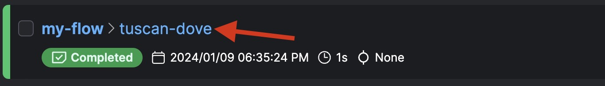

# Basic Syntax Quickstart


### Rules of Thumb
- At a minimum, you need to define at least one flow function.
- Your flows can be segmented by introducing task (`@task`) functions, which can be invoked from within these flows.
- A task represents a discrete unit of Python code, whereas flows are more akin to parent functions accommodating a broad range of workflow logic.
- Flows can be called inside of other flows (we call these subflows) but a task **cannot** be run inside of another task or from outside the context of a flow.

## Module 1 Lab

In this lab you'll create a flow and build upon it in each step. To help you, we've linked to many docs and also provide example python scripts that can be found in this directory.

1. **Create your first [flows](https://docs.prefect.io/latest/concepts/flows/#writing-flows) and [tasks](https://docs.prefect.io/latest/concepts/tasks/#tasks-overview) modeled off the [basic-syntax](basic_syntax.py) script found in this directory.**

    You can use and build upon this first flow in the following sections.
    
    Docs:
    - [Run your first flow](https://docs.prefect.io/latest/tutorial/flows/#run-your-first-flow)
    - [Task Tutorial](https://docs.prefect.io/latest/tutorial/tasks/)
    - [Task Concept Page](https://docs.prefect.io/latest/concepts/tasks/)

    `basic_syntax.py`
    ```python
    import httpx  # requests capability, but can work with async
    from prefect import flow, task

    # Tasks run inside flows.
    # Flows are the main unit of execution in Prefect, they can be scheduled

    @task
    def fetch_weather(lat: float, lon: float):
        base_url = "https://api.open-meteo.com/v1/forecast/"
        weather = httpx.get(
            base_url,
            params=dict(latitude=lat, longitude=lon, hourly="temperature_2m"),
        )
        most_recent_temp = float(weather.json()["hourly"]["temperature_2m"][0])
        return most_recent_temp


    # Tasks can't run inside other tasks.
    @task
    def save_weather(temp: float):
        with open("weather.csv", "w+") as w:
            w.write(str(temp))
        return "Successfully wrote temp"


    # Flows CAN run inside other flows.
    # Docs: https://docs.prefect.io/latest/concepts/flows/#composing-flows
    @flow
    def my_subflow():
        return "Flows can run inside other flows"


    @flow
    def pipeline(lat: float = 38.9, lon: float = -77.0):
        temp = fetch_weather(lat, lon)
        weather = save_weather(temp)
        subflow_result = my_subflow()
        return {"weather": weather, "subflow": subflow_result}


    if __name__ == "__main__":
        pipeline()
    ```
    - Run your flow locally and verify that the flow run shows up in the UI. 
    - Head to the `Flow Runs` page in the UI and click on the animal-adjective flow run name to see your flow run page. ✅
    
---
2. **Try adding [caching](caching_tasks.py) and [retries](retries.py) to your tasks and flows.**

    Docs:
    - [Caching Concept Docs](https://docs.prefect.io/latest/concepts/tasks/#caching)
    - [Retries Concept Docs](https://docs.prefect.io/latest/concepts/tasks/#retries)

    Here is an example of how you can modify the decorators to add these features:

    ```python
    from prefect import flow, task
    from prefect.tasks import task_input_hash, exponential_backoff
    from datetime import timedelta

    @task(cache_key_fn=task_input_hash, cache_expiration=timedelta(minutes=30))
    def hello_task(name_input):
        print(f"Hello {name_input}!")
    
    @task(retries=4, retry_delay_seconds=0.1)
    def fetch_cat_fact():
        cat_fact = httpx.get("https://httpstat.us/Random/200,500", verify=False)
        if cat_fact.status_code >= 400:
            raise Exception()
        print(cat_fact.text)
    ```
    - To verify that the tasks show up in a cached state head to the `Task Runs` tab of the flow run page. ✅
    

    Advanced Docs:
    - [Custom Retry Behavior](https://docs.prefect.io/latest/concepts/tasks/#custom-retry-behavior)
    - [Set up Remote Storage of Results](https://docs.prefect.io/latest/concepts/results/#result-storage-location)
---
3. Add [custom logs](custom_logs.py) to a flow and/or task:

    Docs:
    - [Logs Guide](https://docs.prefect.io/latest/guides/logs/)

    Here is an example of a custom log:
    ```python
    from prefect import flow, get_run_logger

    @flow(name="log-example-flow")
    def log_it():
        logger = get_run_logger()
        logger.info("INFO level log message.")
        logger.debug("You only see this message if the logging level is set to DEBUG. 🙂")

    ```
    - To verify that this log shows up in the UI check out the logs in the `Logs` tab of the flow run page. ✅
---
4. Optional: [Generate an artifact](prefect_artifact.py) in one of your tasks or flows.
    Artifacts are human readable outputs such as tables, Markdown, or links. Artifacts make it easy to track and monitor the objects that your flows produce and update over time. You can think of artifacts as the "customizable tab" of a flow run page in the UI.

    Docs: 
    - [Artifacts Concept Page](https://docs.prefect.io/latest/concepts/artifacts/)

    Here is an example of a markdown artifact:
    ```python
    import httpx
    from prefect import flow, task
    from prefect.artifacts import create_markdown_artifact

    @task
    def mark_it_down(temp):
        markdown_report = f"""# Weather Report        
        ## Recent weather

        | Time        | Temperature |
        |:--------------|-------:|
        | Now | {temp} |
        | In 1 hour       | {temp + 2} |
        """
        create_markdown_artifact(
            key="weather-report",
            markdown=markdown_report,
            description="Very scientific weather report",
        )
    ```
    - Verify that the artifact shows up in the Artifacts tab of the flow run page of the UI. ✅
