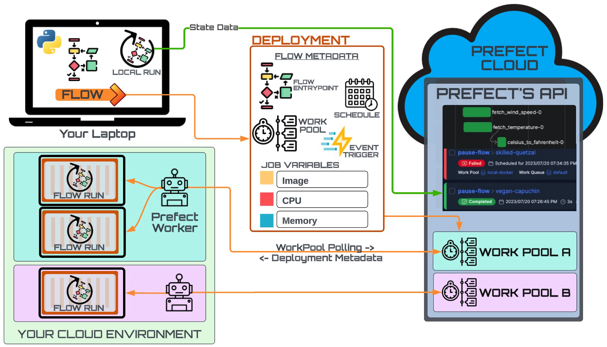

# Deployment Quickstart


For conceptual breakdown of the diagram, go to [Architecture Diagrams Walkthrough](archetecture_diagrams_walkthrough.md).

### 1. [Create a work pool](https://docs.prefect.io/latest/tutorial/workers/#create-a-work-pool) or choose one that already exists in your workspace.
_Creating a work pool in the UI_ is recommended for your first go of it so you that get a sense of all the options.

1. Navigate to the Work Pools page.
    Click the `+` button:
    
2. Select `Docker` for the work pool type.
3. Call your work pool something like `name-pacc-work-pool`.
4. Check out the infrastructure configuration options, but feel free to leave them empty (default) for now.
5. Verify this worked by running the following in your terminal:

    To see any existing work pools:
    ```bash
    prefect work-pool ls
    ``` 
6. Alternatively, you can create a work pool with the following command:

    ```bash
    prefect work-pool create "my-pacc-work-pool" --type docker
    ```

### 2. [Start a worker](https://docs.prefect.io/latest/tutorial/workers/#start-a-worker) to poll this work pool.

1. Ensure the Docker daemon is running on your laptop.

2. Install the required library:

    ```bash
    pip install prefect-docker
    ```

3. On your laptop, open up a new terminal, activate your Python environment, and type:

    ```bash
    prefect worker start --pool my-pacc-work-pool
    ```

4. Keep this terminal process running for as long as you want to run deployments on your laptop. 

### 3. [Create a deployment](https://docs.prefect.io/latest/tutorial/workers/#create-the-deployment) to send your flow to your work pool.


1. Again, ensure the Docker daemon is running because, when you run `flow.deploy()`, [Prefect will build a custom Docker image](https://docs.prefect.io/latest/tutorial/workers/#create-the-deployment:~:text=Prefect%20will%20build%20a%20custom%20Docker%20image%20containing%20your%20workflow%20code%20that%20the%20worker%20can%20use%20to%20dynamically%20spawn%20Docker%20containers%20whenever%20this%20workflow%20needs%20to%20run.) containing your workflow code that the worker can use to dynamically spawn Docker containers whenever this workflow needs to run.

2. Use the [`flow.deploy()`](https://docs.prefect.io/latest/api-ref/prefect/flows/#prefect.flows.Flow.deploy) method to define a deployment:

    Check out the [schedule](https://docs.prefect.io/latest/concepts/schedules/) options [here](https://docs.prefect.io/latest/api-ref/prefect/flows/#prefect.flows.Flow.deploy). Choose between `cron`, `interval`, or `rrule`. In the example below we set an interval schedule for every 50 minutes.

    `my_flow.py`

    ```python title="my_flow.py"
    from prefect import flow


    @flow(log_prints=True)
    def my_flow(name: str = "World"):
        print(f"Hello {name}!")

    if __name__ == "__main__":
        my_flow.deploy(
            name="taylor-pacc-deployment", # add your name and 'pacc'
            work_pool_name="my-pacc-work-pool", # work pool you created earlier
            image="my-first-deployment-image:pacc", # name this whatever you like
            push=False,
            tags=["pacc", "taylor"], # add tags
            interval=3000 # schedule
        )
    ```

3. Run your python script:

    ```bash
    python my_flow.py
    ```

### 4. Find your deployment in the UI and run it using the quick run button at the top right.
1. Go to the deployments page and click on `Quick Run`.
    

2. Alternatively, you can run the deployment from the CLI

    ```bash
    prefect deployment run 'my_flow/my-deployment'
    ```

### 5. Advanced
1. Add an infrastructure-level override such as an environment variable by specifying a `job_variable` on your deployment.
2. Go to the Advanced tab of your work pool's setting to customize your work pool's job configuration.
3. Pause, cancel, and/or retry your flow run.
