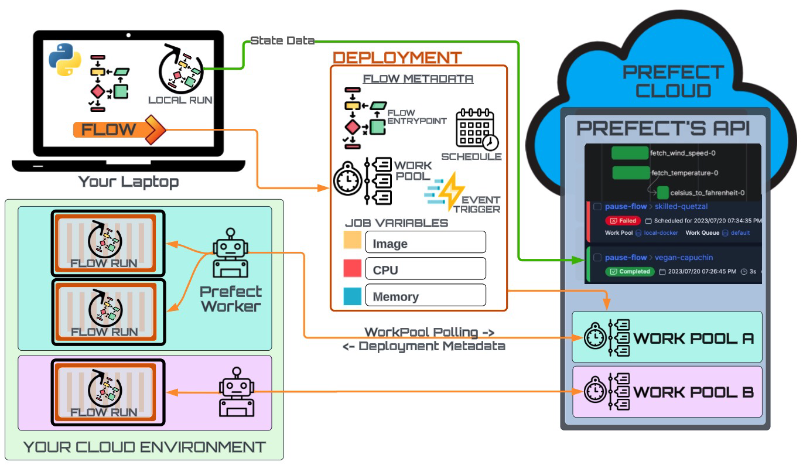
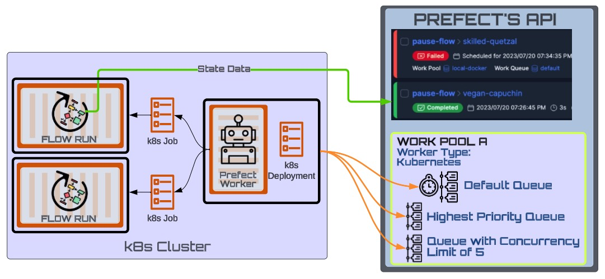
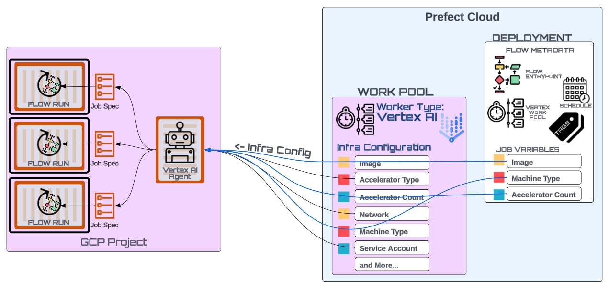

## [Why Deploy](https://docs.prefect.io/latest/tutorial/deployments/#why-deployments)

- Deploying a flow exposes an API and UI so that you can:
    - remotely configure schedules and automation rules for your deployments
    - trigger new runs, cancel active runs, pause scheduled runs, customize parameters, and more
    - **dynamically provision infrastructure using workers** (an optional feature of prefect that we focus on in this cheat sheet)
- A deployment wraps a flow.
- Think of a deployment like your flow’s passport to orchestration land. 🌐 

### Basic Architecture

Flows are **deployed to a work pool** for remote execution facilitated by a [worker process](https://docs.prefect.io/latest/concepts/work-pools/#worker-overview) *started in your desired execution environment*.

#### [Why Workers?](https://docs.prefect.io/latest/tutorial/workers/#why-workers)
- Workers are lightweight polling services that retrieve scheduled runs from a work pool and execute them.
- Workers each have a type corresponding to the execution environment to which they will submit flow runs. 

---

Multiple work pools often represent **different execution environments**.

Workers are designed to dynamically provision infrastructure for each flow run ensuring fine-tuned control of infrastructure utilization.
_Example: A developer might choose between deploying a flow to a Kubernetes work pool or an ECS work pool._

In the work pool, you can establish default infrastructure configurations. These settings will be used to tailor job specifications for each flow run deployed to that specific work pool.

Zooming in on one Work Pool: Work pools can be used to prioritize and/or limit flow runs through the use of (optional) work queues.

### Deployments
- Deployments tie all prefect components together.
- Deployments elevate workflows from functions that you call manually to API-managed entities.
- A flow can have 0 to many deployments.

Attributes of a deployment can include (but are not limited to):
- Flow entrypoint: path to your flow function
- Schedule or Trigger: optional schedule or triggering rule for this deployment
- Work Pool: specifying execution environment
- **Job Variables: Infrastructure configuration to override default values set in work pool.**

---
Default infrastructure settings in the work pool can be overridden at the deployment level, allowing for highly granular provisioning of different infrastructure for each flow run. 

—Therefore, you can think of the work pool as just the default template.

## Summary Diagram
