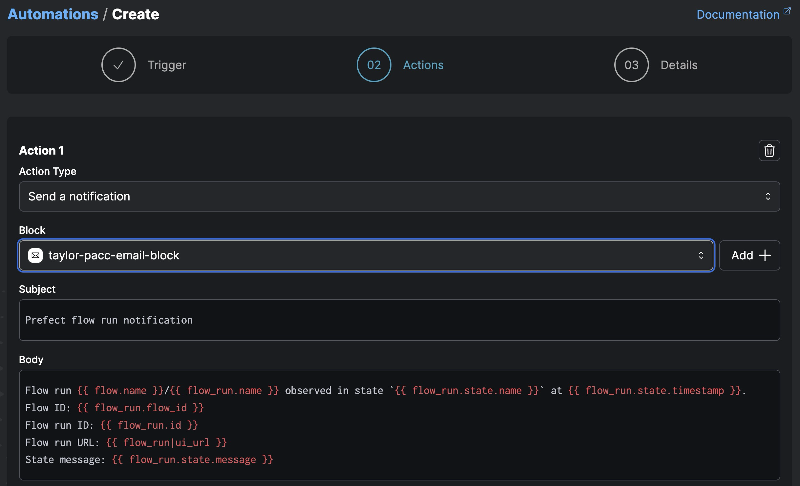
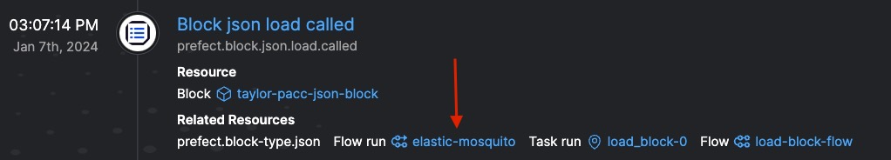
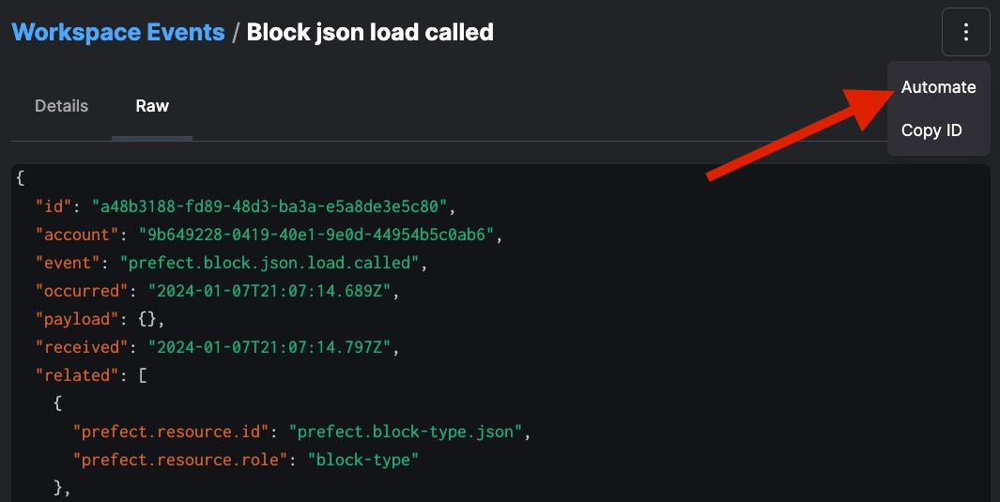
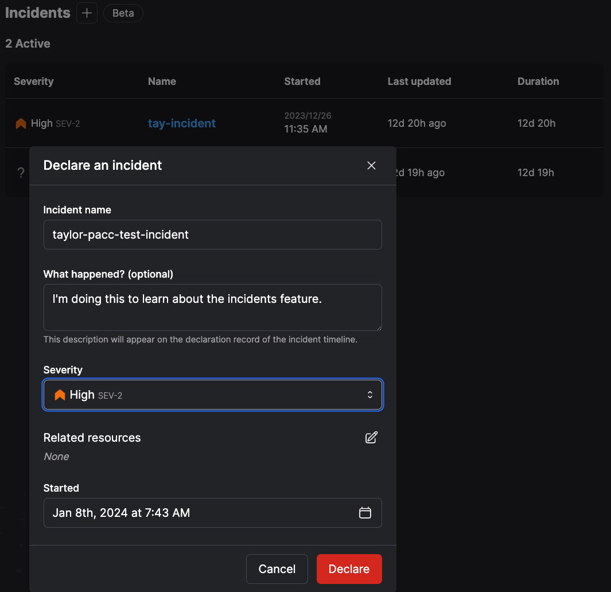
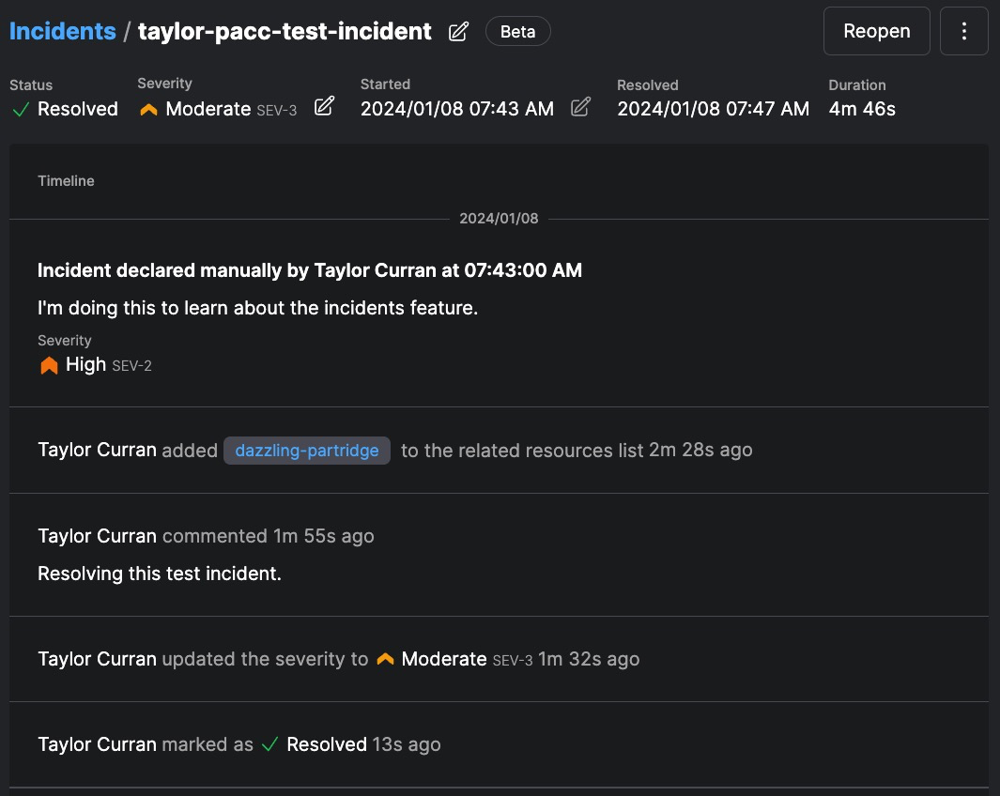

# Automations, Events, and Incidents Quickstart

## 1. Create a notification [automation](https://docs.prefect.io/latest/concepts/automations/) that fires on flow run completion.
1. Find the Automations page in the UI and click the `+` button.
2. Define your trigger:

    Add a tag that will filter out other people's flow runs, ideally you've tagged you deployment with your name, like in this example, I put `taylor`
    
3. Define your action:

    Use the block you created during the [blocks quickstart](../3_blocks_integrations/README.md).
    
4. Name your automation:
    
5. Run a deployment (ensure that it meets the criteria set in your automation's trigger, e.g. the tags `pacc` and `taylor`)

## 2. Browse the [events](https://docs.prefect.io/latest/concepts/events/) dashboard.

1. See if you can spot the events related to the automation you just created:
    
1. What about events related to your deployment?
    
1. Checkout infrastructure related events associated with your deployment:
    
1. How about events relating to the blocks you created today?
    
1. Click on the `Flow run` of a Block event to see _when_ the method was called during the flow's execution:
    
    

## 3. Advanced Automations: Create a [custom trigger](https://docs.prefect.io/latest/concepts/automations/#custom-triggers) and compound [actions](https://docs.prefect.io/latest/concepts/automations/#actions)

In this example, you'll create a custom trigger that results in an action of a [toy webhook](https://webhook.site/) being called.

1. Find an block-based event in the event feed and click into the event details.

    Filter by Resource:
    
2. Click on the `Raw` tab to review the event's JSON values then click on the three dots at the top right and click `Automate`.
    

    You'll see we can describe a custom triggering event using JSON:
    

    **Note:** There are many things we can do to fine tune this custom trigger. For example, we could change the threshold from 1 to 2 if we want this event to occur twice before triggering any action. For more information on trigger grammar, check out [these docs](https://docs.prefect.io/latest/concepts/automations/#custom-triggers).

3. For the action select `Call a webhook` and define a webhook block.
    1. First get a toy webhook endpoint at [Webhook.site](https://webhook.site/)
    2. Copy your unique URL
    3. Back in Prefect's UI, select the action `Call a webhook`
    4. `Add +` a webhook block, paste in your unique URL from [Webhook.site](https://webhook.site/), and click `Create`.
    
4. Add another action to notify yourself about this. 
    
    Your `Actions` page should look something like:
    
5. Call your Automation something like `taylor-pacc-json-block-automation` and save.
6.  Run your flow that loads the block, something like:
    ```python
    from prefect import flow, task
    from prefect.blocks.system import JSON

    @task
    def load_block():
        jb = JSON.load("taylor-pacc-json-block")
        my_dict = jb.value

        print(my_dict)

    @flow(log_prints=True)
    def load_block_flow():
        load_block()

    if __name__ == "__main__":
        load_block_flow()
    ```
7. Verify that you got a notification email and verify that the webhook was called.

## 4. Declare and resolve a [Prefect Incident](https://docs.prefect.io/latest/cloud/incidents/)

[Incidents](https://docs.prefect.io/latest/cloud/incidents/) are formal declarations of disruptions to a workspace. With automations, activity in that workspace can be paused when an incident is created and resumed when it is resolved.

1. Find the `Incidents` page and click the `+` button.
2. Define a test incident, call it something like `your-name-pacc-test` and click `Declare`:
    
3. Add a test comment.
4. Navigate to the `Flow Runs` page and find a failed flow run. (Notice the AI Error Summaries)
    
    
5. Click into a failed flow run, click on the three dots, and then click `Add to incident` 
    
6. Change the severity of the incident.
7. Mark the incident as resolved. ✅
    
8. Note: [Incidents are a more powerful feature when combined with automations](https://docs.prefect.io/latest/cloud/incidents/#incident-automations):
    
    Automations can be used for triggering an incident and for selecting actions to take when an incident is triggered. For example, a work pool status change could trigger the declaration of an incident, or a critical level incident could trigger a notification action.

    To automatically take action when an incident is declared, set up a custom trigger that listens for declaration events.

    ```JSON
    {
    "match": {
        "prefect.resource.id": "prefect-cloud.incident.*"
    },
    "expect": [
        "prefect-cloud.incident.declared"
    ],
    "posture": "Reactive",
    "threshold": 1,
    "within": 0
    }
    ```

    
