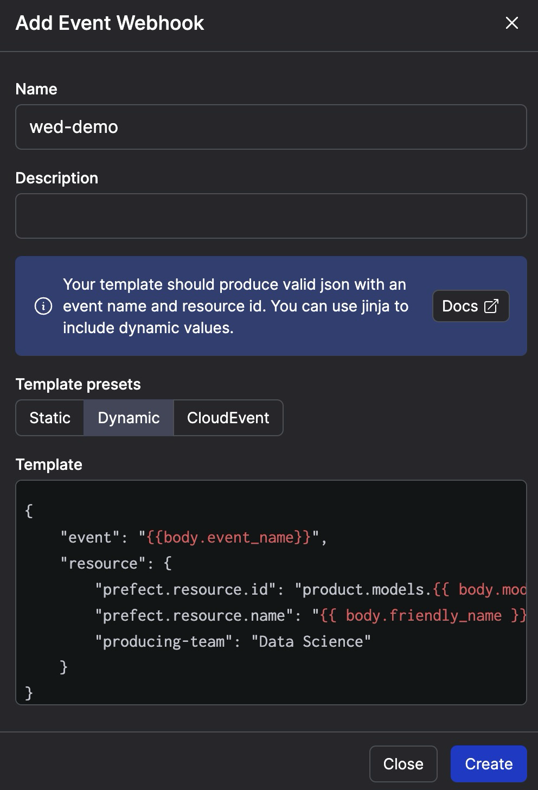

# Example

Create a dynamic webhook



```bash
curl -X POST 'https://api.prefect.cloud/hooks/u<redacted>w' -H "Content-Type: application/json" -d '{"event_name": "model.refreshed", "model": "regression_v2", "friendly_name": "Updated Regression Model"}'
```
